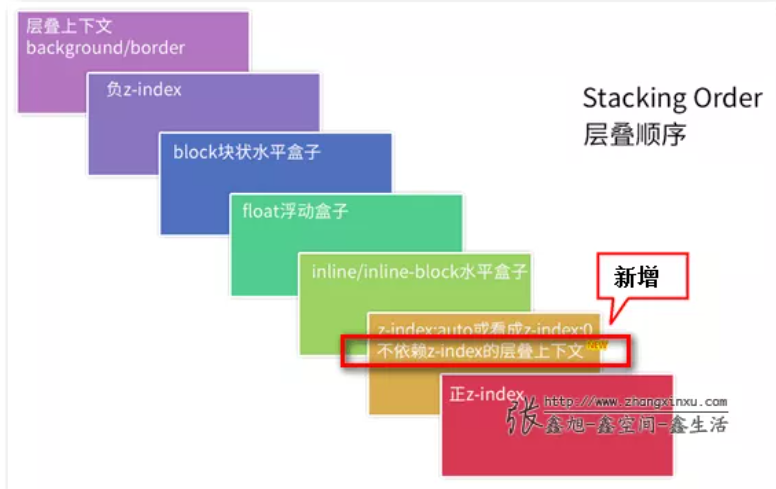

1. Style标签写在body后和body前有什么区别?

- 一般情况下,页面加载时自上而下的。将stye标签至于body之前,为的是先加载样式。
- 若是写在body标签之后,由于浏览器以逐行方式对html文档进行解析,当解析到写在写在文档尾部的样式表时,会导致浏览器停止之前的渲染,等待加载且解析样式表完成之后会重新渲染,在 windows的E下可能会出现FOUC现象(页面闪烁)。

2. 什么是FOUC(Flash of Unstyled Content)?如何来避免fouC

- 当使用@import导入CSS时,会导致某些页面在出现奇怪的现象:没有样式的页面内容显示瞬间闪烁,这种现象被称为“文档样式暂时失效”,简称FOUC.
- 产生原因:当样式表晚于结构性html加载时,加载到此样式表时,页面将会停止之前的渲染。等待此样式表被下载和解析后,再重新渲染页面,期间导致短暂的花屏现象。
- 解决办法:只要在之间加入一个或者元素即可。

<!-- more -->

1. css样式
    - 可继承样式    font-size, font-fastClick, color, ul, li, dd, dl
    - 不可继承样式  width, height, padding, border, margin

2. 伪元素和伪类
   - 伪元素
     - **::selection** 选择被用户选择的元素
     - **::first-line** 选择元素的第一行
     - **::first-letter** 选择元素中的第一个字符
     - **::after** 在元素后添加内容
     - **::before** 在元素之前添加内容
   - 伪类
     - **:root**  html 元素
     - **:empty**  选择没有子元素的元素
     - **target** 选择当前活动的目标元素
     - **:enabled** 选择可用的表单元素
     - **:disabled** 选择禁用的表单元素
     - **:checked** 选择被选中的表单元素
     - **:first-child** 选取当前选择器下第一个元素。
     - **:last-child** 和 **:first-child** 相反，选取当前选择器下最后一个元素。
     - **:only-child** 选取唯一子元素。如果一个元素的父元素只有它一个子元素，这个伪类就会生效。如果一个元素还有兄弟元素，这个伪类就不会对它生效。
     - **:only-of-type** 选取唯一的某个类型的元素。如果一个元素的父元素里只有它一个当前类型的元素，这个伪类就会生效。这个伪类允许父元素里有其他元素，只要不和自己一样就可以。
     - **:link**
     - **:hover**
     - **:active**
   - 伪元素和伪类的区别
        1. 它们是否创造了新的元素(抽象)。伪元素创建了，伪类没有
        2. 伪元素只能出现一次
        3. 伪类则是像类一样发挥着类的作用，没有数量上的限制，只要不是相互排斥的伪类，也可以同时使用在相同的元素上面
        4. 伪类用一个冒号表示 :first-child，伪元素则使用两个冒号表示 ::first-line(为了向下兼容，现在的浏览器中伪元素选择器用单冒号和双冒号都可以)
3. 关于盒模型
    - IE 盒模型(怪异盒模型)
        - width = border + padding + content
        - 一个盒子的占据空间 width + margin
    - W3C盒模型
      - width = content
      - 一个盒子的占据空间 width + padding + boarder + margin
    - 转换盒模型
        ```
        box-sizing: content-box; // W3C盒模型标准
        box-sizing: border-box; // IE盒模型标准
        ```
4. 盒子的一些相关的尺寸
   1. client
      - clientWidth = width + padding
      - clientLeft = border-left-width
      - clientHeight = height + padding
      - clientTop = border-top-width
   2. offset
      - offsetWidth = width + padding + border
      - offsetLeft = 当前元素 **左边框** **外边缘** 到 最近的已定位父级（offsetParent） **左边框** **内边缘**的距离。如果父级都没有定位，则分别是到body 顶部 和左边的距离
      - offsetTop = 当前元素 **上边框** **外边缘** 到 最近的已定位父级（offsetParent） **上边框** **内边缘**的 距离。如果父 级都没有定位，则分别是到body 顶部 和左边的距离
    1. scroll
        - scrollWidth 可视区域和隐藏区域的 width
        - scrollHeight 可视区域和隐藏区域的 height
        - scrollTop 内容层 top 端到可视区域top 端的距离
        - scrollTop 内容层 left 端到可视区域 left 端的距离
    >常见应用，判断滚动到底部 el.scrollHeight - (el.offsetHeight + el.scrollTop) < 10
5. BFC
    block format context 特点是内部子元素绝不会影响外部的元素
    1. 根元素(html)
    2. 绝对定位元素：position (absolute、fixed)
    3. 浮动元素: float 除 none 以外的值
    4. display 为 inline-block、table-cell、table-caption、flex、inline-flex
    5. overflow 除了 visible 以外的值 (hidden、auto、scroll)

6. BFC 有哪些用途
   1. 同一个 bfc 下外边距会发生折叠
   2. 可以包含浮动的元素
   3. 可以阻止元素被浮动元素覆盖
   
7. 元素高度，宽度获取， style, currentStyle, getComputedStyle getBoundingClientRect
    - dom.style.width 只能获取内联样式
    - dom.currentStyle.width Element.currentStyle 是一个与 window.getComputedStyle方法功能相同的属性。这个属性实现在旧版本的IE浏览器中。
    - window.getComputedStyle  方法返回一个对象，该对象在应用活动样式表并解析这些值可能包含的任何基本计算后报告元素的所有CSS属性的值。因此输出的值是准确的
    - window.getBoundingClientRect 对象包含了一组用于描述边框的只读属性-——- left、top、right 和 bottom，单位为px。除了 width 和 height 外的属性都是相对于视口的左上角位置而言的。
  
8. 全屏滚动的原理
    类似于轮播图，整体元素一直排列下去，假设有5个需要展示的全屏页面，那么高度将回是500%，但我们只能展示100%，剩下的内容可以通过 transform 进行 Y 轴定位， 也可以通过 margin-top 实现

    **涉及css 属性**
    overflow:hiidden | transition: all 1s ease;

9. z-index层叠上下文
    - z-index 可以解决元素之前的覆盖顺序问题，设置它的层叠顺序
    - 如果元素是没有定位的，对其设置的 z-index 会是无效的

    ## 元素层叠时，覆盖关系准则(*)
    ### 同父同级元素
      - 当具有明显的层叠水平标识时，如识别的 z-index 值 
        - z-index大的覆盖小的，数值越大，越靠近视觉点。
        - z-index相同时，在DOM流中处于后面会覆盖前面
     - 都没有设置 z-index 时， 使用默认值，一个定位一个没有定位，那么定位覆盖未定位元素
     - 都没有发生定位且发生位置重合现象时，在 dom 流中处于后面的会覆盖前面
    ### 父子层级元素
      - 不同父元素，只要父元素越大，那么整体就越靠近视觉点，而不管其子元素大小情况。
      - 如果父元素 z-index 有效，那么子元素无论是否设置 z-index 都和父元素一致，会在父元素上方；
      - 如果父元素 z-index 失效（未定位或者使用默认值），那么定位子元素的 z-index 设置生效。

## 层叠上下文的创建

### 根层叠上下文

指的是页面根元素，也就是滚动条的默认的始作俑者元素。这就是为什么，绝对定位元素在left/top等值定位的时候，如果没有其他定位元素限制，会相对浏览器窗口定位的原因。👉

### 定位元素与传统层叠上下文

对于包含有position:relative/position:absolute/position:fixed的定位元素，当其z-index值不是auto的时候，会创建层叠上下文。👉

### CSS3与新时代的层叠上下文

CSS3的出现除了带来了新属性，同时还对过去的很多规则发出了挑战。例如，👉CSS3 transform对overflow隐藏对position:fixed定位的影响等。而这里，层叠上下文这一块的影响要更加广泛与显著。
如下：

1. z-index值不为auto的flex项(父元素display:flex|inline-flex).
2. 元素的opacity值不是1.
3. 元素的transform值不是none.
4. 元素mix-blend-mode值不是normal.
5. 元素的filter值不是none.
6. 元素的isolation值是isolate.
7. will-change指定的属性值为上面任意一个。
8. 元素的-webkit-overflow-scrolling设为touch



10. CSS优化及性能提升

- 将css文件放在页面最上面，多个css可合并，并尽量减少http请求

- 避免过渡约束，避免使用后代选择符，链式选择符，多种类型选择符

- 避免不必要的命名空间，避免不必要的重复样式，移除空的css规则

- 使用具有语义的名字，使用紧凑的语法

- 避免使用 !important

- 尽可能地精简规则，尽可能合并不同类的重复规则，修复解析错误

- 正确使用display属性
  - inline后不应该使用width、height、margin、padding以及float
  - inline-block后不应该使用float；block后不应该使用vertical-align

- 不滥用浮动，遵守盒模型规则

- 不滥用web字体，不声明过多font-size，不重复定义h1-h6，不给h1-h6定义过多样式

- 值为0时不需要任何单位

- 标准化各种浏览器前缀