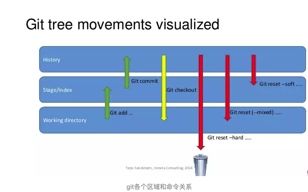

有时候，我们用Git的时候有可能commit提交代码后，发现这一次commit的内容是有错误的，那么有两种处理方法：
 1、修改错误内容，再次commit一次 2、使用**git reset** 命令撤销这一次错误的commit
 第一种方法比较直接，但会多次一次commit记录。
 而我个人更倾向第二种方法，错误的commit没必要保留下来。
 那么今天来说一下**git reset**。它的一句话概括

```undefined
git-reset - Reset current HEAD to the specified state
```

意思就是可以让HEAD这个指针指向其他的地方。例如我们有一次commit不是不是很满意，需要回到上一次的Commit里面。那么这个时候就需要通过reset，把HEAD指针指向上一次的commit的点。
 它有三种模式，soft,mixed,hard，具体的使用方法下面这张图，展示的很全面了。




### reset 不加参数(mixed)：保留工作目录，并清空暂存区

	reset 如果不加参数，那么默认使用 --mixed 参数。它的行为是：保留工作目录，并且清空暂存区。也就是说，工作目录的修改、暂存区的内容以及由 reset 所导致的新的文件差异，都会被放进工作目录。简而言之，就是「把所有差异都混合（mixed）放在工作目录中」。

### reset --soft

	保留工作目录，并把重置 HEAD 所带来的新的差异放进暂存区(staged)

### reset --hard  重置stage区和工作目录

	reset --hard 会在重置 HEAD 和branch的同时，重置stage区和工作目录里的内容。当你在 reset 后面加了 --hard 参数时，你的stage区和工作目录里的内容会被完全重置为和HEAD的新位置相同的内容。换句话说，就是你的没有commit的修改会被全部擦掉。

