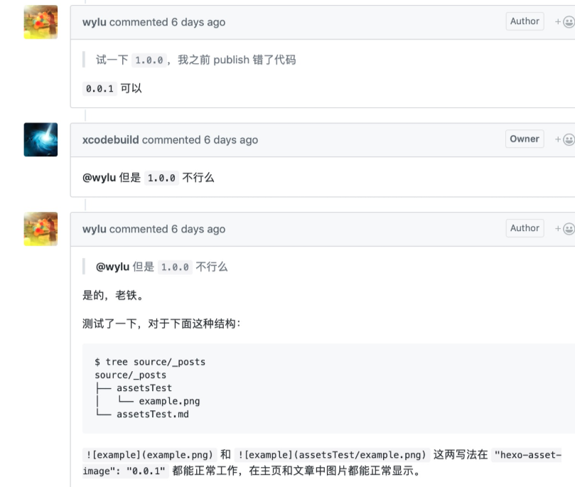

在网上查了有两种方式,哪种好用,则自己选择,个人是主推第二种方式

第一种方式,在第三方网站上上传图片,譬如七牛,然后在你博客中已下面格式即可插入图片,

```

```
优点:不占git空间.
缺点:图片管理的想自杀
第二种方式,在本地插入,hexo官网也有相关说明,hexo图片上传说明

设置站点配置_config.yml:将post_asset_folder: false改为post_asset_folder: true

执行hexo new [xxxx],生成xxxx.md和xxxx文件夹

把要引用的图片拷贝到xxxx文件夹中

```
来引用本地图片
```
如果想使用markdown语法来保持文章编辑整洁,那么可以使用hexo-asset-image插件来实现

那么配置的顺序则为:

设置站点配置_config.yml:将post_asset_folder: false改为post_asset_folder: true

执行 npm install hexo-asset-image –save 装插件

执行hexo new [xxxx],生成xxxx.md和xxxx文件夹

把要引用的图片拷贝到xxxx文件夹中

使用****来引用本地图片

然后么,你可能会遇到一个问题,发现图片没有上传,嘿嘿嘿,那走的坑就跟我的一样了.

后面就跟你们说下这个问题的解决方案是怎么发现的



解决方案： 将hexo-asset-image版本切到0.0.1版本试试

