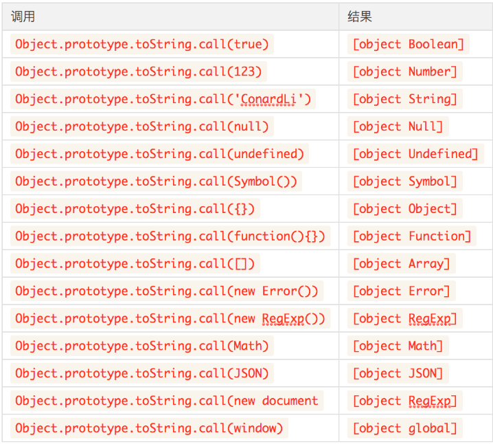

[toc]

#### typeof 
取值范围
* number
* string
* object
* function
* boolean
* symbol
* boolean

```
typeof 12 // 'number'
typeof 'aa' // 'string'
typeof false // 'boolean'
typeof {} // 'object'
typeof function(){} // 'function'
typeof [] // 'object'
typeof new Date() // 'object'
typeof Symbol() // 'symbol'
typeof /\w+/ig  // 'object'
```
#### instanceof
instanceof操作符可以帮助我们判断引用类型具体是什么类型的对象：
```
[] instanceof Array // true
new Date() instanceof Date // true
new RegExp() instanceof RegExp // true
```
我们先来回顾下原型链的几条规则：

    1.所有引用类型都具有对象特性，即可以自由扩展属性
    2.所有引用类型都具有一个__proto__（隐式原型）属性，是一个普通对象
    3.所有的函数都具有prototype（显式原型）属性，也是一个普通对象
    4.所有引用类型__proto__值指向它构造函数的prototype
    5.当试图得到一个对象的属性时，如果变量本身没有这个属性，则会去他的__proto__中去找
[] instanceof Array实际上是判断Array.prototype是否在[]的原型链上。

所以，使用instanceof来检测数据类型，不会很准确，这不是它设计的初衷：
```
[] instanceof Object // true
function(){}  instanceof Object // true
```
另外，使用instanceof也不能检测基本数据类型，所以instanceof并不是一个很好的选择。

#### toString
上面我们在拆箱操作中提到了toString函数，我们可以调用它实现从引用类型的转换。

>每一个引用类型都有toString方法，默认情况下，toString()方法被每个Object对象继承。如果此方法在自定义对象中未被覆盖，toString() 返回 "[object type]"，其中type是对象的类型。
```
const obj = {};
obj.toString() // [object Object]
```
注意，上面提到了如果此方法在自定义对象中未被覆盖，toString才会达到预想的效果，事实上，大部分引用类型比如Array、Date、RegExp等都重写了toString方法。

我们可以直接调用Object原型上未被覆盖的toString()方法，使用call来改变this指向来达到我们想要的效果。



#### jquery中判断类型的方式
```
var types = [
  'Boolean',
  'Number',
  'String',
  'Function',
  'Array',
  'Date',
  'RegExp',
  'Object',
  'Error',
  'Symbol'
]

var class2type = {}

types.forEach(name => {
  class2type[`[object ${name}]`] = name.toLocaleLowerCase()
})

function type(obj) {
  if (obj == null) {
    return obj+''
  }
  return typeof obj === 'object' 
  ? class2type[Object.prototype.toString.call(obj)] || 'object' 
  : typeof obj
}

测试：
console.log(type(12))   // number
console.log(type('12'))  // string 
console.log(type(false))  // boolean
console.log(type({}))    // object
console.log(type([]))  // object
console.log(type(Symbol()))   //symbol
console.log(type(function(){}))  //function
console.log(type(undefined))     //undefined
console.log(type(null))    // null
console.log(type(Boolean(1)))
```