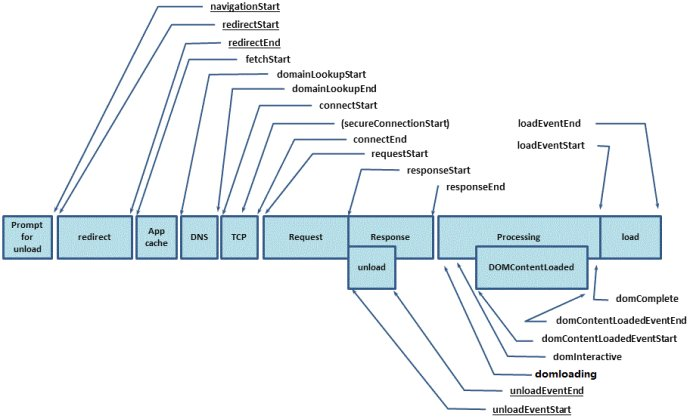

###  performance时间顺序图




## 1.performance.timing对象

> navigationStart：当前浏览器窗口的前一个网页关闭，发生unload事件时的Unix毫秒时间戳。如果没有前一个网页，则等于fetchStart属性。
>
> unloadEventStart：如果前一个网页与当前网页属于同一个域名，则返回前一个网页的unload事件发生时的Unix毫秒时间戳。如果没有前一个网页，或者之前的网页跳转不是在同一个域名内，则返回值为0。
>
> unloadEventEnd：如果前一个网页与当前网页属于同一个域名，则返回前一个网页unload事件的回调函数结束时的Unix毫秒时间戳。如果没有前一个网页，或者之前的网页跳转不是在同一个域名内，则返回值为0。
>
> redirectStart：（重定向时间）返回第一个HTTP跳转开始时的Unix毫秒时间戳。如果没有跳转，或者不是同一个域名内部的跳转，则返回值为0。
>
> redirectEnd：（重定向时间）返回最后一个HTTP跳转结束时（即跳转回应的最后一个字节接受完成时）的Unix毫秒时间戳。如果没有跳转，或者不是同一个域名内部的跳转，则返回值为0。
>
> fetchStart：返回浏览器准备使用HTTP请求读取文档时的Unix毫秒时间戳。该事件在网页查询本地缓存之前发生。
>
> domainLookupStart：返回域名查询开始时的Unix毫秒时间戳。如果使用持久连接，或者信息是从本地缓存获取的，则返回值等同于fetchStart属性的值。
>
> domainLookupEnd：返回域名查询结束时的Unix毫秒时间戳。如果使用持久连接，或者信息是从本地缓存获取的，则返回值等同于fetchStart属性的值。
>
> connectStart：返回HTTP请求开始向服务器发送时的Unix毫秒时间戳。如果使用持久连接（persistent connection），则返回值等同于fetchStart属性的值。
>
> connectEnd：返回浏览器与服务器之间的连接建立时的Unix毫秒时间戳。如果建立的是持久连接，则返回值等同于fetchStart属性的值。连接建立指的是所有握手和认证过程全部结束。
>
> secureConnectionStart：返回浏览器与服务器开始安全链接的握手时的Unix毫秒时间戳。如果当前网页不要求安全连接，则返回0。
>
> requestStart：返回浏览器向服务器发出HTTP请求时（或开始读取本地缓存时）的Unix毫秒时间戳。
>
> responseStart：返回浏览器从服务器收到（或从本地缓存读取）第一个字节时的Unix毫秒时间戳。
>
> responseEnd：返回浏览器从服务器收到（或从本地缓存读取）最后一个字节时（如果在此之前HTTP连接已经关闭，则返回关闭时）的Unix毫秒时间戳。
>
> domLoading：返回当前网页DOM结构开始解析时（即Document.readyState属性变为“loading”、相应的readystatechange事件触发时）的Unix毫秒时间戳。
>
> domInteractive：返回当前网页DOM结构结束解析、开始加载内嵌资源时（即Document.readyState属性变为“interactive”、相应的readystatechange事件触发时）的Unix毫秒时间戳。
>
> domContentLoadedEventStart：返回当前网页DOMContentLoaded事件发生时（即DOM结构解析完毕、所有脚本开始运行时）的Unix毫秒时间戳。
>
> domContentLoadedEventEnd：返回当前网页所有需要执行的脚本执行完成时的Unix毫秒时间戳。
>
> domComplete：返回当前网页DOM结构生成时（即Document.readyState属性变为“complete”，以及相应的readystatechange事件发生时）的Unix毫秒时间戳。
>
> loadEventStart：返回当前网页load事件的回调函数开始时的Unix毫秒时间戳。如果该事件还没有发生，返回0。
>
> loadEventEnd：返回当前网页load事件的回调函数运行结束时的Unix毫秒时间戳。如果该事件还没有发生，返回0。

有了这些api，我们就可以计算一些需要的时间数据了


```javascript
// 计算加载时间
function getPerformanceTiming () {  
    var performance = window.performance;
 
    if (!performance) {
        // 当前浏览器不支持
        console.log('你的浏览器不支持 performance 接口');
        return;
    }
 
    var t = performance.timing;
    var times = {};
 
    //【重要】页面加载完成的时间
    //【原因】这几乎代表了用户等待页面可用的时间
    times.loadPage = t.loadEventEnd - t.navigationStart;
 
    //【重要】解析 DOM 树结构的时间
    //【原因】反省下你的 DOM 树嵌套是不是太多了！
    times.domReady = t.domComplete - t.responseEnd;
 
    //【重要】重定向的时间
    //【原因】拒绝重定向！比如，http://example.com/ 就不该写成 http://example.com
    times.redirect = t.redirectEnd - t.redirectStart;
 
    //【重要】DNS 查询时间
    //【原因】DNS 预加载做了么？页面内是不是使用了太多不同的域名导致域名查询的时间太长？
    // 可使用 HTML5 Prefetch 预查询 DNS ，见：[HTML5 prefetch](http://segmentfault.com/a/1190000000633364)            
    times.lookupDomain = t.domainLookupEnd - t.domainLookupStart;
 
    //【重要】读取页面第一个字节的时间
    //【原因】这可以理解为用户拿到你的资源占用的时间，加异地机房了么，加CDN 处理了么？加带宽了么？加 CPU 运算速度了么？
    // TTFB 即 Time To First Byte 的意思
    // 维基百科：https://en.wikipedia.org/wiki/Time_To_First_Byte
    times.ttfb = t.responseStart - t.navigationStart;
 
    //【重要】内容加载完成的时间
    //【原因】页面内容经过 gzip 压缩了么，静态资源 css/js 等压缩了么？
    times.request = t.responseEnd - t.requestStart;
 
    //【重要】执行 onload 回调函数的时间
    //【原因】是否太多不必要的操作都放到 onload 回调函数里执行了，考虑过延迟加载、按需加载的策略么？
    times.loadEvent = t.loadEventEnd - t.loadEventStart;
 
    // DNS 缓存时间
    times.appcache = t.domainLookupStart - t.fetchStart;
 
    // 卸载页面的时间
    times.unloadEvent = t.unloadEventEnd - t.unloadEventStart;
 
    // TCP 建立连接完成握手的时间
    times.connect = t.connectEnd - t.connectStart;
 
    return times;
}
```

## 2.performance.now()

获取当前的微秒数，比Date.now()更精确，微秒是毫秒的1000倍。Date.now() 输出的是 UNIX 时间，即距离 1970 的时间，而 performance.now() 输出的是相对于 performance.timing.navigationStart(页面初始化) 的时间。


```javascript
var start = performance.now();
...
var end = performance.now();

console.log('耗时：' + (end - start) + '微秒。');

Date.now()
// 1544255347157
performance.now()
// 9580145.67
```

## 3.performance.mark()

顾名思义，就是标记，在程序运行中对其进行时间标记。方便我们计算程序的运行耗时。


```javascript
// 执行前做个标记
window.performance.mark('markStart');
// do ...
window.performance.mark('markEnd');
// 测量两个标记之间的测量距离
window.performance.measure('measure1', 'markStart', 'markEnd');
// 看下保存起来的标记 mark
var marks = window.performance.getEntriesByType('mark');  
console.log(marks);  
// 看下保存起来的测量 measure
var measure = window.performance.getEntriesByType('measure');  
console.log(measure);  
// 清除指定标记
window.performance.clearMarks('markStart');  
// 清除所有标记
window.performance.clearMarks();
 
// 清除指定测量
window.performance.clearMeasures('measure1');  
// 清除所有测量
window.performance.clearMeasures();  
```

## 4.performance.getEntries()

浏览器获取网页时，会对网页中每一个对象（脚本文件、样式表、图片文件等等）发出一个HTTP请求。performance.getEntries方法以数组形式，返回这些请求的时间统计信息，有多少个请求，返回数组就会有多少个成员。以PerformanceNavigationTiming对象形式返回

## 5.performance.navigation对象

提供一些用户行为信息

### 5.1 performance.navigation.type

该属性返回一个整数值，表示网页的加载来源，可能有以下4种情况：

> 0：网页通过点击链接、地址栏输入、表单提交、脚本操作等方式加载，相当于常数performance.navigation.TYPE_NAVIGATENEXT。
>
> 1：网页通过“重新加载”按钮或者location.reload()方法加载，相当于常数performance.navigation.TYPE_RELOAD。
>
> 2：网页通过“前进”或“后退”按钮加载，相当于常数performance.navigation.TYPE_BACK_FORWARD。
>
> 255：任何其他来源的加载，相当于常数performance.navigation.TYPE_UNDEFINED。

### 5.2 performance.navigation.redirectCount

该属性表示当前网页经过了多少次重定向跳转.

## 6.参考链接

[Performance API](http://javascript.ruanyifeng.com/bom/performance.html)
 [初探 performance – 监控网页与程序性能](http://www.alloyteam.com/2015/09/explore-performance/)


作者：Juliana_
链接：https://www.jianshu.com/p/47a6b7866ba6
来源：简书
著作权归作者所有。商业转载请联系作者获得授权，非商业转载请注明出处。

