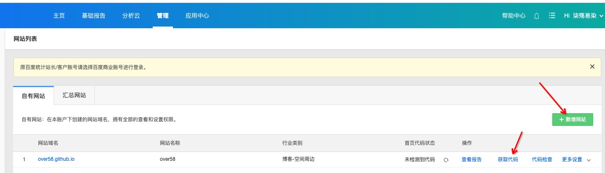
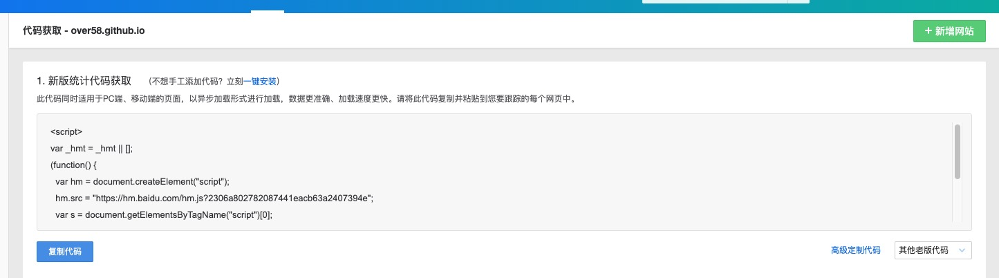
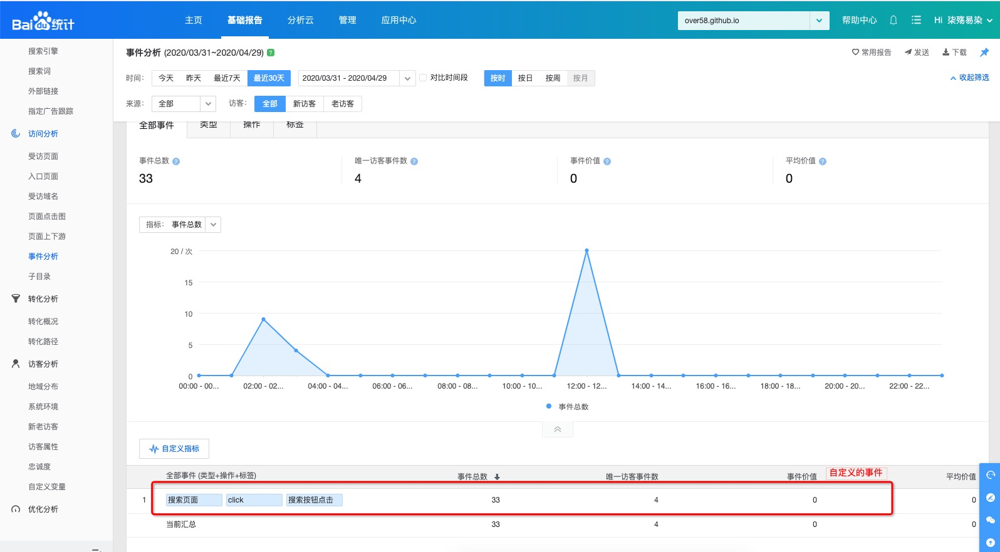

<!-- more -->

### step 1

添加网站，并点击“获取代码”按钮，然后到了下图



复制代码并添加到网站的页面中


### step 2

在需要埋点的地方调用

```
/**
category: 自定义
action: click|show
label: 自定义
value: 置为''就行， 目前没发现有啥用处
**/
window._hmt.push(['_trackEvent', category, action, label, value])

```

 ### step 3

讲代码提交发布后，等上一段时间，并不会立刻实时的显示出来，不要以为自己写错了，一通排查...

成功后可以查看到如图所示：

