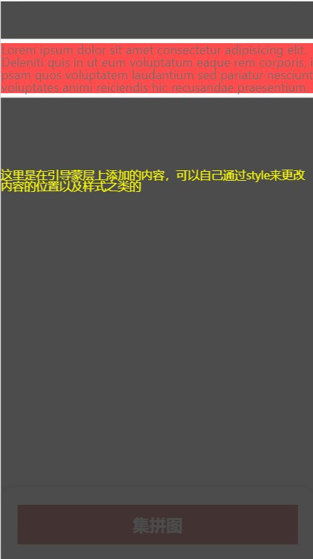

Js项目中有时候需要为新用户进行引导操作是=时，需要弹窗来告诉新用户如何进行一步步操作。之前的时候用过introjs,现在看了下实现原理，主要是去更改z-index来实现重点元素“凸出”到蒙层上面。最近看了一篇文章，学到了一个感觉非常新颖的思路，利用[globalCompositeOperation](https://developer.mozilla.org/zh-CN/docs/Web/API/CanvasRenderingContext2D/globalCompositeOperation)的思路将蒙层中需要凸显的那块儿给“抠掉”。

# 使用方法

在需要重点凸显的元素上直接加id: "intro-item”, 所以目前同一个页面只支持一个元素凸显出来。

# 代码

```js

<template>
  <div v-show="show" class="intro-mask">
    <canvas ref="canvas" />
    <div class="content">
      <slot />
    </div>
  </div>
</template>

<script>
/**
 * 目的：用于引导弹窗中需要凸显某个元素
 * 用法：需要凸显的元素添加id 为intro-item，然后引入intro-mask就行，可以自己在slot中添加额外的元素
 * 注意：需要在intro-item渲染出来之后，在启用这个组件
 */
import { onMounted, ref, toRefs, nextTick } from 'vue'
export default {
  props: {
    backgroundColor: {
      type: String,
      default: 'rgba(0, 0, 0, 0.7)',
    },
    expandX: {
      type: Number,
      default: 5,
    },
    expandY: {
      type: Number,
      default: 5,
    },
  },
  setup(props, { emit }) {
    let show = ref(true)
    const canvas = ref(null)

    const draw = function() {
      const introItem = document.getElementById('intro-item')
      if (introItem) {
        const clientWidth = document.documentElement.clientWidth
        const clientHeight = document.documentElement.clientHeight
        canvas.value.width = clientWidth
        canvas.value.height = clientHeight
        let { height = 0, width = 0, top = 0, left = 0 } = introItem.getBoundingClientRect()

        // 向外拓展凸显元素的返回
        width = Math.min(clientWidth, width + props.expandX * 2)
        height = Math.min(clientHeight, height + props.expandY * 2)
        left = Math.max(0, Math.min(left - props.expandX, left))
        top = Math.max(0, Math.min(top - props.expandY, top))

        const ctx = canvas.value.getContext('2d')
        ctx.fillStyle = props.backgroundColor
        ctx.fillRect(0, 0, canvas.value.width, canvas.value.height)
        ctx.globalCompositeOperation = 'xor'
        ctx.fillStyle = '#fff'
        ctx.fillRect(left, top, width, height)
        emit('transfer-data', { height, width, top, left })
      } else {
        show = false
        console.warn('未找到#intro-item元素')
      }
    }

    onMounted(function() {
      draw()
    })

    return {
      canvas,
      show,
    }
  },
}
</script>

<style lang="less" scoped>
.intro-mask {
  position: fixed;
  top: 0;
  left: 0;
  right: 0;
  bottom: 0;

  canvas {
    width: 100%;
    height: 100%;
  }

  .content {
    color: #000;
    position: absolute;
    top: 0;
    left: 0;
    right: 0;
    bottom: 0;
  }
}
</style>

```

# 运行截图



