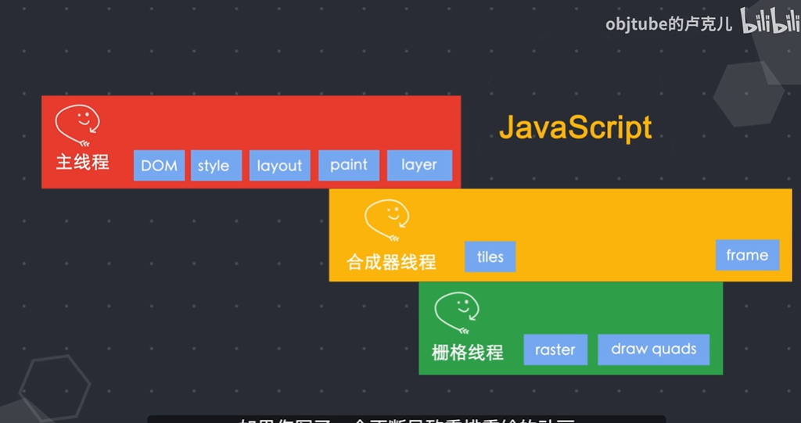

## 浏览器是一个多进程架构

## 页面渲染分为以下的步骤

1. 网络进程获取到html之后通过ipc传递到渲染器主进程
2. 解析html 创建dom树
3. 解析css进行样式计算
4. 结合dom树和样式计算后的结果，确定节点的大小和位置，形成layout tree
5. **paint** - 遍历layout tree 确定节点的绘制顺序层级表
6. **laryer** - 布局 然后根据主进程将layoutTree 和绘制信息表传给合成器线程
7. 合成器线程 - 将得到的信息分图层分成更小的图块
8. 栅格线程 - 将更小的图块进行栅格化raster，返还给合成器线程draw quads图块信息 存储在GPU中
9. frame 合成器将栅格线程返回的图块合成帧交给浏览器进程
10. 浏览器进程 收到一帧的图像后传给GPU进行渲染

##  为什么要避免大量的重排和重绘，以及为啥使用tranform就好

重排的话，会导致页面重新走一遍上面的所有流程

重绘的话（比如改颜色）， 只走了layout , layer 和之后的流程

transform的话， 不占用主线程(不卡顿)，直接就是合成器线程和栅格线程进行操作(少了大量计算)

## 为什么要使用requestAnimationFrame呢

我们都知道，页面的刷新频率最起码达到60ms一帧的时候，我们才不会觉得页面卡顿。如果说我们做了一个极其耗费时间的js操作，导致下一帧应该渲染的时候，由于js计算占据这主线程，那么原本的那一帧并没有渲染，这称之为掉帧。使用requestAnimationFrame的好处就是呢， 会将主线程的任务分散到每一帧的间隔，到了该渲染下一帧的时候，先把工作暂停下来，等待渲染结束后计算计算，从而不影响动画的流程

> 参考自https://www.bilibili.com/video/BV1x54y1B7RE?from=search&seid=4107892898942828381