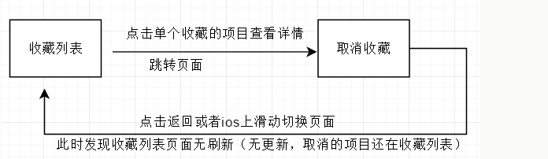

在做移动端项目的时候经常遇到这样一个功能比如： 



返回后页面不刷新，一些失效的信息依然显示在页面上。这个问题在iphone手机上会出现。

onpageshow 事件在用户浏览网页时触发。

onpageshow 事件类似于 [onload](http://www.runoob.com/jsref/event-onload.html) 事件，onload 事件在页面第一次加载时触发， onpageshow 事件在每次加载页面时触发，即 **onload 事件在页面从浏览器缓存中读取时不触发**，**此外还有pagehide在不显示的时候触发。**

为了查看页面是直接从服务器上载入还是从缓存中读取，可以使用 PageTransitionEvent 对象的 persisted 属性来判断。

```js
window.addEventListener('pageshow', function(event) {
    console.log("PageShow Event  " + event.persisted);
    console.log(event)
})
```

**如果页面从浏览器的缓存中读取该属性返回 ture，否则返回 false。然后在根据true或false在执行相应的页面刷新动作或者直接ajax请求接口更新数据。这一点有个缺陷就是，无论是不是需要更新数据这个页面都会刷新，我们要做的只是数据变化了才需要更新。于是想到另一个办法在可能会出现数据变化的页面设置缓存，即为只要页面数据变化了就写缓存一条记录，在返回页面后检测到这条记录就说明需要页面刷新或调用接口刷新。**

**处理方法为：**

```js
// a.html 设置刷新 检测缓存是否有标志 要是有就说明数据有变化  a.html跳转到b.html页面
window.addEventListener("pageshow", function(){
    if(sessionStorage.getItem("need-refresh")){
        location.reload();
        sessionStorage.removeItem("need-refresh");
    }
});

// b.html 如果是数据变化了就写一条缓存   b.html返回到a.html页面
sessionStorage.setItem("need-refresh", true);
```

> 摘自https://www.cnblogs.com/wangmaoling/p/8022561.html