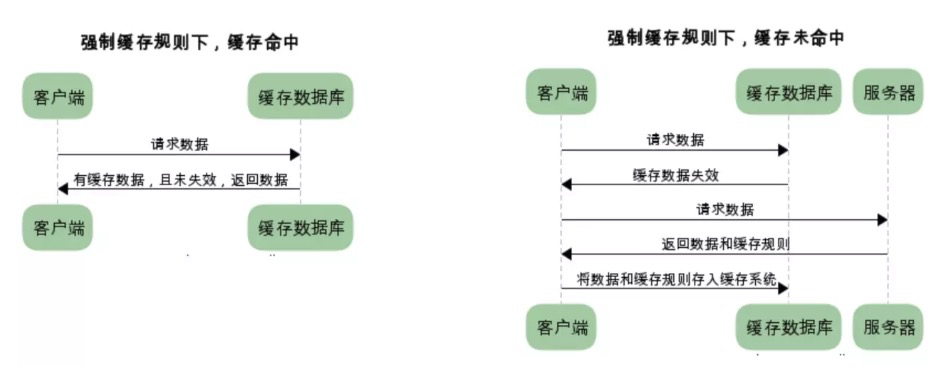
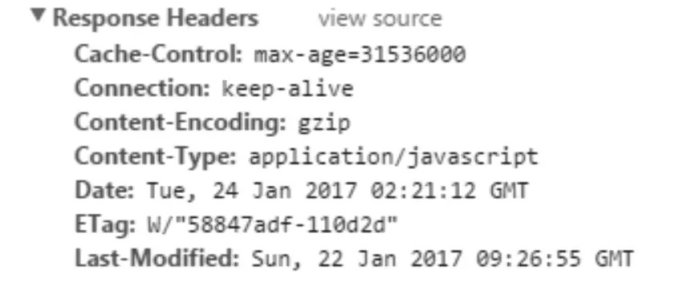

# 前言

缓存机制无处不在，有客户端缓存，服务端缓存，代理服务器缓存等。在HTTP中具有缓存功能的是浏览器缓存。 HTTP缓存作为web性能优化的重要手段，对于从事web开发的朋友有重要的意义。本文将围绕以下几个方面来整理HTTP缓存：

- 缓存的规则
- 缓存的方案
- 缓存的优点
- 不同刷新的请求执行过程

## 缓存的规则

我们知道HTTP的缓存属于客户端缓存，后面会提到为什么属于客户端缓存。所以我们认为浏览器存在一个缓存数据库，用于储存一些不经常变化的静态文件（图片、css、js等）。我们将缓存分为强制缓存和协商缓存。下面我将分别详细的介绍这两种缓存的缓存规则。

### 强制缓存

当缓存数据库中已有所请求的数据时。客户端直接从缓存数据库中获取数据。当缓存数据库中没有所请求的数据时，客户端的才会从服务端获取数据。

<!-- more -->

### 协商缓存

又称对比缓存，客户端会先从缓存数据库中获取到一个缓存数据的标识，得到标识后请求服务端验证是否失效（新鲜），如果没有失效服务端会返回304，此时客户端直接从缓存中获取所请求的数据，如果标识失效，服务端会返回更新后的数据。

#### 控制强缓存的字段按优先级介绍

1. **Pragma**    `Pragma`是HTTP/1.1之前版本遗留的通用首部字段，仅作为于HTTP/1.0的向后兼容而使用。虽然它是一个通用首部，但是它在响应报文中时的行为没有规范，依赖于浏览器的实现。RFC中该字段只有`no-cache`一个可选值，会通知浏览器不直接使用缓存，要求向服务器发请求校验新鲜度。因为它优先级最高，当存在时一定不会命中强缓存。
2. **Cache-Control**    `Cache-Control`是一个通用首部字段，也是HTTP/1.1控制浏览器缓存的主流字段。和浏览器缓存相关的是如下几个响应指令：

1. **Pragma**    `Pragma`是HTTP/1.1之前版本遗留的通用首部字段，仅作为于HTTP/1.0的向后兼容而使用。虽然它是一个通用首部，但是它在响应报文中时的行为没有规范，依赖于浏览器的实现。RFC中该字段只有`no-cache`一个可选值，会通知浏览器不直接使用缓存，要求向服务器发请求校验新鲜度。因为它优先级最高，当存在时一定不会命中强缓存。
2. **Cache-Control**    `Cache-Control`是一个通用首部字段，也是HTTP/1.1控制浏览器缓存的主流字段。和浏览器缓存相关的是如下几个响应指令：

| 指令        | 参数   | 说明                                                         |
| ----------- | ------ | ------------------------------------------------------------ |
| private     | 无     | 表明响应只能被单个用户缓存，不能作为共享缓存（即代理服务器不能缓存它） |
| public      | 可省略 | 表明响应可以被任何对象（包括：发送请求的客户端，代理服务器，等等）缓存 |
| no-cache    | 可省略 | 缓存前必需确认其有效性                                       |
| no-store    | 无     | 不缓存请求或响应的任何内容                                   |
| max-age=[s] | 必需   | 响应的最大值                                                 |

- **max-age**（单位为s）设置缓存的存在时间，相对于发送请求的时间。只有响应报文首部设置`Cache-Control`为非0的`max-age`或者设置了大于请求日期的`Expires`（下文会讲）才有可能命中强缓存。当满足这个条件，同时响应报文首部中`Cache-Control`不存在`no-cache`、`no-store`且请求报文首部不存在`Pragma`字段，才会真正命中强缓存。

- **no-cache**  表示请求必须先与服务器确认缓存的有效性，如果有效才能使用缓存（`协商缓存`），无论是响应报文首部还是请求报文首部出现这个字段均一定不会命中强缓存。Chrome硬性重新加载（Command+shift+R）会在请求的首部加上`Pragma：no-cache`和`Cache-Control：no-cache`。
- **no-store**  表示禁止浏览器以及所有中间缓存存储任何版本的返回响应，一定不会出现强缓存和协商缓存，适合个人隐私数据或者经济类数据。
- **public** 表明响应可以被浏览器、CDN等等缓存。
- **private** 响应只作为私有的缓存，不能被CDN等缓存。如果要求HTTP认证，响应会自动设置为`private`。
- **Expires**    Expires是一个响应首部字段，它指定了一个日期/时间，在这个时间/日期之前，HTTP缓存被认为是有效的。无效的日期比如0，表示这个资源已经过期了。如果同时设置了`Cache-Control`响应首部字段的`max-age`，则`Expires`会被忽略。它也是HTTP/1.1之前版本遗留的通用首部字段，仅作为于HTTP/1.0的向后兼容而使用。

#### 小贴士：

两类缓存机制可以同时存在，强制缓存的优先级高于协商缓存，当执行强制缓存时，如若缓存命中，则直接使用缓存数据库数据，不在进行缓存协商。

## 缓存的方案

上面的内容让我们大概了解了缓存机制是怎样运行的，但是，服务器是如何判断缓存是否失效呢？我们知道浏览器和服务器进行交互的时候会发送一些请求数据和响应数据，我们称之为HTTP报文。报文中包含首部header和主体部分body。与缓存相关的规则信息就包含在header中。boby中的内容是HTTP请求真正要传输的部分。举个HTTP报文header部分的例子如下：

接下来我们将对HTTP报文中出现的与缓存规则相关的信息做出详细解释。（我们依旧分为强制缓存和协商缓存两个方面来介绍）

### 强制缓存

对于强制缓存，服务器响应的header中会用两个字段来表明——Expires和Cache-Control。

#### Expires

Exprires的值为服务端返回的数据到期时间。当再次请求时的请求时间小于返回的此时间，则直接使用缓存数据。但由于服务端时间和客户端时间可能有误差，这也将导致缓存命中的误差，另一方面，Expires是HTTP1.0的产物，故现在大多数使用Cache-Control替代。

#### Cache-Control

Cache-Control有很多属性，不同的属性代表的意义也不同。 

| 指令        | 参数   | 说明                                                         |
| ----------- | ------ | ------------------------------------------------------------ |
| private     | 无     | 表明响应只能被单个用户缓存，不能作为共享缓存（即代理服务器不能缓存它） |
| public      | 可省略 | 表明响应可以被任何对象（包括：发送请求的客户端，代理服务器，等等）缓存 |
| no-cache    | 可省略 | 缓存前必需确认其有效性                                       |
| no-store    | 无     | 不缓存请求或响应的任何内容                                   |
| max-age=[s] | 必需   | 响应的最大值                                                 |

### 协商缓存

​		协商缓存需要进行对比判断是否可以使用缓存。浏览器第一次请求数据时，服务器会将缓存标识与数据一起响应给客户端，客户端将它们备份至缓存中。再次请求时，客户端会将缓存中的标识发送给服务器，服务器根据此标识判断。若未失效，返回304状态码，浏览器拿到此状态码就可以直接使用缓存数据了。 对于协商缓存来说，缓存标识我们需要着重理解一下，下面我们将着重介绍它的两种缓存方案。、

#### Last-Modified

Last-Modified： 服务器在响应请求时，会告诉浏览器资源的最后修改时间。

if-Modified-Since: 浏览器再次请求服务器的时候，请求头会包含此字段，后面跟着在缓存中获得的最后修改时间。服务端收到此请求头发现有if-Modified-Since，则与被请求资源的最后修改时间进行对比，如果一致则返回304和响应报文头，浏览器只需要从缓存中获取信息即可。 从字面上看，就是说：从某个时间节点算起，是否文件被修改了

1. 如果真的被修改：那么开始传输响应一个整体，服务器返回：200 OK
2. 如果没有被修改：那么只需传输响应header，服务器返回：304 Not Modified

if-Unmodified-Since: 从字面上看, 就是说: 从某个时间点算起, 是否文件没有被修改

1. 如果没有被修改:则开始`继续'传送文件: 服务器返回: 200 OK
2. 如果文件被修改:则不传输,服务器返回: 412 Precondition failed (预处理错误)

这两个的区别是一个是修改了才下载一个是没修改才下载。 Last-Modified 说好却也不是特别好，因为如果在服务器上，一个资源被修改了，但其实际内容根本没发生改变，会因为Last-Modified时间匹配不上而返回了整个实体给客户端（即使客户端缓存里有个一模一样的资源）。为了解决这个问题，HTTP1.1推出了Etag。

#### Etag

Etag： 服务器响应请求时，通过此字段告诉浏览器当前资源在服务器生成的唯一标识（生成规则由服务器决定）

If-None-Match： 再次请求服务器时，浏览器的请求报文头部会包含此字段，后面的值为在缓存中获取的标识。服务器接收到次报文后发现If-None-Match则与被请求资源的唯一标识进行对比。

1. 不同，说明资源被改动过，则响应整个资源内容，返回状态码200。
2. 相同，说明资源无心修改，则响应header，浏览器直接从缓存中获取数据信息。返回状态码304.

但是实际应用中由于Etag的计算是使用算法来得出的，而算法会占用服务端计算的资源，所有服务端的资源都是宝贵的，所以就很少使用Etag了。

## 缓存的优点

1. 减少了冗余的数据传递，节省宽带流量
2. 减少了服务器的负担，大大提高了网站性能
3. 加快了客户端加载网页的速度 这也正是HTTP缓存属于客户端缓存的原因。

## 不同刷新的请求执行过程

1. 浏览器地址栏中写入URL，回车 浏览器发现缓存中有这个文件了，不用继续请求了，直接去缓存拿。（最快）
2. F5 就是告诉浏览器，别偷懒，好歹去服务器看看这个文件是否有过期了。于是浏览器就战战兢兢的发送一个请求带上If-Modify-since。
3. Ctrl+F5 告诉浏览器，你先把你缓存中的这个文件给我删了，然后再去服务器请求个完整的资源文件下来。于是客户端就完成了强行更新的操作.

作者：北海北方
链接：https://juejin.im/post/5a1d4e546fb9a0450f21af23
来源：掘金
著作权归作者所有。商业转载请联系作者获得授权，非商业转载请注明出处。

